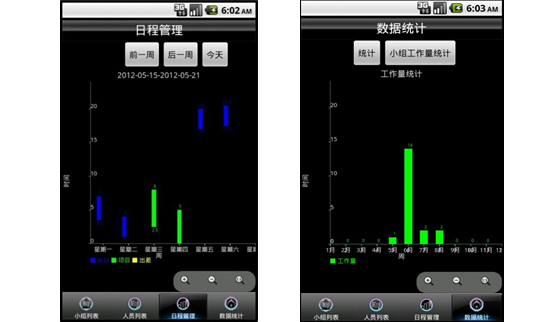

# Medium_03_DevelopmentCollaborationPlatform
2012 第三届全国服务外包创新创业大赛三等奖作品

# 关于

## 项目概述

针对目前外包行业没有很好的开发协作模式，产业链不合理等问题，我们开发了软件园外包协作平台，我们采用了让中小型软件外包公司抱团的方式，集中各公司优势，增强竞争力，加大宣传力度，从而提升企业知名度，提升园区接单能力。在此平台中，我们推出了良好的协作模式，并实时反馈开发进度，它也是一种开发人员和客户之间的沟通形式。

## 功能介绍

软件外包服务平台的目标是打造一个以开发协作、统一接单、人才实训三大功能为基础的软件园协作平台。

提供一个良好的开发协作平台，实现软件外包服务工作的流程化、标准化。该平台能够为参与项目开发的人员提供一个信息交流的媒介。客户可以通过平台对所属项目进行监督与审核，企业员工能够通过此平台实现项目任务分配，对项目开发任务做出相应安排，同时对项目进度进行信息反馈，便于用户监督审查。

统一接单平台为国内外外包企业、发包企业、金融、电子商务等各行业提供交流、合作、宣传、接单等服务。在此平台客户能够通过项目意向提交功能，来提交客户发包意向信息，同时具有项目意向变更申请模块，让客户具有提出需求变更申请的权利。并提供咨询平台，实现疑难解答功能。

人才实训平台，此平台包含实训预约、远程培训、项目培训动态、一周实训安排、教学课件等功能模块，不仅能为学员提供培训的各项信息，还能让学员在此进行培训的预约操作。平台为学员与加盟合作的培训机构间提供了良好桥梁作用。实现为园区内外企业以及高校大学生提供实训服务的目的。

# 系统效果

